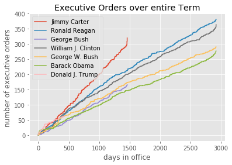

# Executive Order plots Jupyter notebook

I wanted to compare how many Executive Orders Trump is signing compared to recent previous presidents.


```python
from datetime import datetime

import requests
from bs4 import BeautifulSoup
import matplotlib.pyplot as plt
from matplotlib import style

style.use('ggplot')
```


```python
URL_TEMPLATE = 'http://www.presidency.ucsb.edu/executive_orders.php?Submit=DISPLAY&year={year}'
def get_executive_orders(start_year=1826):
    for year in range(start_year, datetime.now().year + 1):
        resp = requests.get(URL_TEMPLATE.format(year=year))
        soup = BeautifulSoup(resp.content, 'html.parser')
        table = soup.form.next_sibling.next_sibling
        for row in table.find_all('tr')[1:]:
            columns = row.find_all('td')
            try:
                date = datetime.strptime(columns[1].text, '%B %d, %Y')
            except ValueError:
                # for some reason one of the dates is June 0 ¯\_(ツ)_/¯
                if columns[1].text == 'June 0, 1887':
                    date = datetime(1887, 6, 1)
                else:
                    print('skipping unparsable date {}'.format(columns[1].text))
                    continue
            yield {
                'president': columns[0].text,
                'date': date,
                'name': columns[2].text,
                'link': columns[2].a['href'],
            }
```

Simplify by only using presidents after 1937 when inaugurations are on Jan 20th and simplify even more to avoid issues with impeachment(Nixon) and assassinations(JFK) by skipping to 1977 (Jimmy Carter)


```python
orders_by_president_by_day_of_presidency = {}
inauguration_dates = {}
for order in get_executive_orders(1977):
    if order['date'] < datetime(1977, 1, 20):
        continue
    if order['president'] not in inauguration_dates:
        inauguration_dates[order['president']] = order['date'].replace(day=20)
    start_date = inauguration_dates[order['president']]
    orders = orders_by_president_by_day_of_presidency.setdefault(order['president'], {})
    order['day'] = int((order['date'] - start_date).total_seconds() / 60 / 60 / 24)
    if order['day'] not in orders:
        orders[order['day']] = 1
    else:
        orders[order['day']] += 1
```


```python
for president, orders in sorted(orders_by_president_by_day_of_presidency.items(),
                                key=lambda x: inauguration_dates[x[0]]):
    x = range(max(orders) + 1)
    y = []
    total = 0
    for i in x:
        total += orders.get(i, 0)
        y.append(total)
    plt.plot(x, y, label=president, drawstyle='steps-post')

plt.legend()
plt.title('Executive Orders over entire Term')
plt.xlabel('days in office')
plt.ylabel('number of executive orders')
plt.show()
```





```python
days = (datetime.now() - inauguration_dates['Donald J. Trump']).total_seconds() / 60 / 60 / 24
max_ = 0
for president, orders in sorted(orders_by_president_by_day_of_presidency.items(),
                                key=lambda x: inauguration_dates[x[0]]):
    if max(orders) > max_:
        max_ = max(orders)
    x = range(max_ + 1)[:int(days)]
    y = []
    total = 0
    for i in x:
        total += orders.get(i, 0)
        y.append(total)
    plt.plot(x, y, label=president, drawstyle='steps-post')

plt.legend()
plt.title("Executive Orders compared to Trump's term so far")
plt.xlabel('days in office')
plt.ylabel('number of executive orders')
plt.show()
```


And out of curiosity, how do those spikes at the ends of terms compare


```python
for president, orders in sorted(orders_by_president_by_day_of_presidency.items(),
                                key=lambda x: inauguration_dates[x[0]]):
    if president == 'Donald J. Trump':
        continue  # skip Trump, his term hasn't ended yet :'(
    last_day = max(orders)
    y = []
    total = 0
    for i in range(last_day - 180, last_day + 1):
        total += orders.get(i, 0)
        y.append(total)
    plt.plot(range(181), y, label=president, drawstyle='steps-post')

plt.legend()
plt.title('Executive Orders in last month in Office')
plt.xlabel('days in office')
plt.ylabel('number of executive orders')
plt.show()
```


